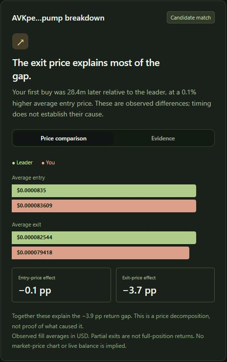

# CopyCheck

A focused Solana trade review app. Compare a wallet you followed with your own and inspect differences in observed entry prices, exits and timing.

[Try the live app](https://copycheck-trade-review.mszajnowiec.chatgpt.site/) · [Technical white paper](docs/CopyCheck-white-paper.pdf) · [Developer reference](docs/Developer-reference.html)



## Included
- Interactive fictional example with four distinct cases: higher entry price, worse exit, partial exit and missing follower record.
- A server-side CoinGecko wallet-trades integration with cursor pagination, deduplication, request timeout and a five-page budget per wallet.
- Per-token price comparison, transaction evidence, percentage-point attribution and JSON report export.
- Responsive interface and optional WebMCP tools for the same visible journeys.

## Run
Use Node 22.13 or later. Run `npm ci`, then `npm run dev`. Build with `npm run build`. Tests: `node --experimental-strip-types --test tests/analysis.test.ts`. Types: `npx tsc --noEmit`.

The app works immediately in demo mode. Real wallet requests require the server secret `COINGECKO_API_KEY` with access to CoinGecko Pro wallet-trades data. Configure this as a server-side secret in your own hosting environment. For local Cloudflare development, use an untracked `.dev.vars` file containing that variable. Never use a browser-exposed variable or commit the real value.

Live wallet-trades access was verified on 6 October 2026 using an entitled server key. A saved example is included in `docs/example.json`. Your own key still requires wallet-trades endpoint access; the status indicator only checks whether a key is configured.

## Data and formulas
Source endpoint: GET /api/v3/onchain/networks/solana/wallets/{address}/trades.
- Two inclusive UTC dates, up to 30 days; today ends at request time.
- Five pages of up to 300 records per wallet. Any truncated history or skipped invalid records suppresses the headline comparison.
- Group by exact, case-sensitive token contract address.
- Compare one observed position per token; repeated closed/reopened positions are excluded.
- Require an observed first follower buy from 0 to 30 minutes after the leader's. This is a heuristic candidate match, not proof of copy intent.
- Quantity-weighted entry = total observed buy USD / tokens bought. Exit uses sale USD / tokens sold.
- Closed means observed buy/sell quantities reconcile within 0.00001% relative rounding tolerance. Opposing fills in the same timestamp are considered ambiguously ordered.
- Gross return = (exit / entry - 1) * 100.
- Headline averages give each eligible token equal weight; they are not portfolio returns.
- Entry effect = (leader exit / follower entry - leader exit / leader entry) * 100.
- Exit effect = (follower exit / follower entry - leader exit / follower entry) * 100.
- Effects sum to follower return minus leader return, in percentage points.

These are CopyCheck calculations, not CoinGecko ratings. Timing is an observed block-timestamp difference. It does not prove bot latency or causally separate slippage from a moving market. A counterfactual executable quote is not available.

## Limits
Wallet-trades data does not establish initial inventory, transfers, every trading venue or actual remaining wallet balance. It does not itemize gas, priority tips, bot fees or platform fees. Results are gross estimates from returned swaps, not accounting or tax records. Missing records do not establish failed trades. Partly exited positions are shown but excluded from closed-position returns. Return decomposition applies to fill averages, not a claim that every fill copied another fill.

Addresses are sent to CoinGecko when the user requests a live comparison. The app has no database and does not intentionally persist submitted addresses or reports. Browser export saves the current report locally. Hosting and API providers may retain their ordinary service logs. API responses use no-store. The linked demo is public. The comparison route currently has no application-level authentication, quota or rate limiter. Add those controls before operating an unrestricted public instance using your own API allowance.

## CoinGecko
- [API overview](https://www.coingecko.com/en/api)
- [API pricing](https://www.coingecko.com/en/api/pricing)
- [Wallet trades documentation](https://docs.coingecko.com/reference/wallet-trades)
- [Documentation](https://docs.coingecko.com/)

This project is independent of CoinGecko. Synthetic demo tokens, wallets and transactions are fictional and carry no blockchain links.


## Local configuration

Copy `.dev.vars.example` to `.dev.vars`, then set `COINGECKO_API_KEY` with your own entitled key. Do not use a `NEXT_PUBLIC_` variable. Without a key the synthetic example still works.

```sh
npm ci
npm run dev
```

Open the local address printed by the development server (normally http://localhost:5173). This is a Vite/vinext application using Cloudflare Worker bindings, not a generic Next.js server deployment. The public checkout intentionally omits the original site's project binding. Associate your own project before deployment; cloning this source does not give access to the hosted demo's credentials.

## Saved example and documentation

The saved report is the article's AVKpe…pump example, captured from the live app on **6 October 2026 at 11:58:14 UTC**. Wallet A returned **-1.1454%** and Wallet B **-5.0122%** before fees (-1.15% and -5.01% in the article). B minus A is **-3.8668 percentage points**: -0.1284 from entry prices and -3.7384 from exit prices under CopyCheck's decomposition.

| Observed result | Wallet A (leader input) | Wallet B (follower input) |
| --- | --- | --- |
| Buys / sells | 1 / 1 | 3 / 1 |
| USD spent | $36.64 | $67.46 |
| USD received | $36.22 | $64.08 |
| Gross dollar result | -$0.42 | -$3.38 |

To repeat the comparison in the app, enter:

- **Wallet you followed (A):** `Af3tCQpsogVJSKMwQxhyhodzVCSF7pnLepBuTtgWALKs`
- **Your wallet (B):** `HWAoWvdBW2bHn5sSbxnYf8X3uuGfk6v5VZ5Aa7ya6nQf`
- **From and to:** `2026-10-06` (UTC).
- **Token:** `AVKpeeWaCku3Mni5THbY4bkBnMrPzAEnnQKtP3wPpump`.

Click **Compare wallets**, then open the token's price comparison and Evidence tab. Both histories returned one page with complete pagination and zero skipped records at capture time. Later API results may differ as provider data changes; the JSON preserves the captured trades and results. To reproduce the arithmetic offline without an API key, run `node --experimental-strip-types scripts/verify-example.ts`.

This pair had the most negative follower-minus-leader return difference among 84 eligible token comparisons discovered from 60 public wallets. It was deliberately selected, not a representative copy-trading result. The addresses are test roles, not a verified copying relationship. Fees, transfers and earlier holdings are not reconciled; these figures do not establish net wallet losses or bot failure.

The white paper and technical reference below are historical documentation and may show the earlier example. Use `docs/example.json` and the instructions above for the current article example.

- [Saved report JSON](docs/example.json)
- [White paper](docs/CopyCheck-white-paper.pdf)
- [Browsable technical reference](docs/Developer-reference.html) (download and open locally)

The documentation describes source snapshot `ca57fc0758fea5e20fc5f31512b45592fad02a66` from the development checkout. That historical identifier is not a commit in this clean public repository. The application logic is preserved; publication changes cover documentation, examples, CI and removal of the original hosting project binding.

## Validation

```sh
node --experimental-strip-types --test tests/analysis.test.ts
npx tsc --noEmit
npm run build
```

Fourteen tests cover matching, arithmetic, incomplete histories, pagination, input validation and upstream errors. These are not an independent security audit or a guarantee of complete provider coverage.

## Third-party notices

Retain the notices in `build/sites-vite-plugin.LICENSE` and `vendor/shadcn-tailwind-4.13.0.LICENSE.md`. Dependencies retain their respective licenses. This repository does not add a blanket license over third-party code.
